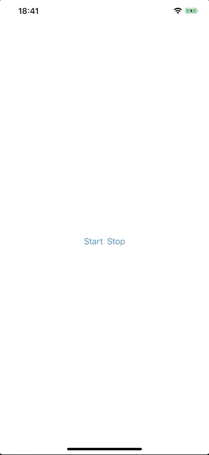

# ActivityIdicator_SwiftUI

 - Activity Indicator control for SwiftUI 
 - Not readily available but can be made by conforming to UIViewRepresentable protocol
 


### Usage

```
import SwiftUI

struct ContentView: View {
    
    @State private var isLoading: Bool = false
    
    var body: some View {
        VStack {
            ActivityIndicatorView(animating: $isLoading, style: .large)
            
            HStack {
                Button("Start") {
                    self.isLoading = true
                }
                
                Button("Stop") {
                    self.isLoading = false
                }
            }
        }
    }
}
```

### Preview

